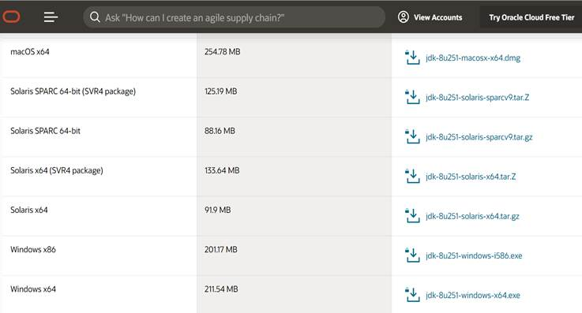

# SEGUNDO_PROYECTO: ANIMACION
## Autores: Luis Guillermo Velez - Johan Aguirre Diaz
### Situación problema:
Se necesita un catalogo de personajes en el que nuestros personajes tengan la posibilidad de realizar movivimientos en 4 direccione (arriba,izquierda,derecha ,abajo) y que se vea reflejado en pantalla; los personajes también deben tener la posibilidad de realizar un movimiento especial

### Analisis del problema:

Para esta situación utilizaremos el patron abstract factory para guardar los sprites de nuestros personajes (bomberman,ninja) ,tambien utilizamos el "MVC" para poder manejar de forma mas adecuada la interfaz gráfica . 

### Principios utilizados:
##### Modelo,vista,Contolador (MVC):
Este principio lo podemos ver reflejada en la parte del menu, donde si se selecciona algun personaje con el respectivo boton, la clase VistaMenu llama a la clase controladorMenu, la cual esta que personaje se va usar, y por ultimo llama a la clase Modelo, a traves de la clase vista, y esta clase modelo  guarda todos los datos y es la encargada de manejar el sistema de movimientos.

### Requerimientos
* **Tener instalado Java Development Kit.**
* **Tener instalado  Netbeans.**

_Nota: si no se tiene instalado puede seguir el siguiente intructivo._ 

**Instalar Java Development Kit:**
1. Descargamos el instalador de Java Development Kit en [https://www.oracle.com/java/technologies/javase/javase-jdk8-downloads.html](https://www.oracle.com/java/technologies/javase/javase-jdk8-downloads.html).

2. Ejecutar el instalador e instalar el Java Development Kit:

**Instalar Netbeans:**

1. Descargamos el instalador de Netbeans en:
[https://netbeans.apache.org/download/index.html](https://netbeans.apache.org/download/index.html).

2. Ejecutamos el instalador e instalar el Netbeans:

            
### Manual de usuario:
